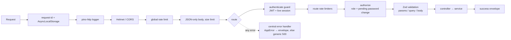

# Architecture

Maintenance Monitor is a **modular monolith**: one deployable service whose code is split into cohesive
modules with explicit dependencies. Modules communicate through constructor-injected services and, for
side effects that should not couple modules, through an in-process domain event bus.

## Modules

| Module                | Responsibility                                                                                      | Depends on                            |
| --------------------- | --------------------------------------------------------------------------------------------------- | ------------------------------------- |
| `auth`                | Login, refresh-token rotation, logout, change/forgot/reset password, sessions, authentication guard | users, audit, mail                    |
| `users`               | Technician onboarding, user administration, own profile                                             | auth (sessions, hashing), audit, mail |
| `machines`            | Machine master data (name, serial, description, activation). Never writes status.                   | audit                                 |
| `machine-logs`        | Maintenance/fault logs and **the only code path that changes machine status**                       | machines, audit, events               |
| `analytics`           | Read-only aggregates over live data                                                                 | database                              |
| `audit`               | Append-only audit writer (with sanitisation) and admin read API                                     | database                              |
| `notifications`       | `mail` (SMTP transport + templates) and `realtime` (Socket.IO status board)                         | auth, events                          |
| `health`              | Health and liveness checks                                                                          | database, mail                        |
| `common`              | Route system, errors, validation, pagination, logging, events, utilities                            | —                                     |
| `config` / `database` | Typed environment configuration; data source, migrations, seeds                                     | —                                     |

## Layers inside a module

```
routes      HTTP contract: method, path, roles, Zod schemas, OpenAPI metadata
controller  Thin adapter: validated input → service call → response envelope
service     Business rules, transactions, authorization-sensitive decisions, audit
policies    Pure, centralised rules (state transitions, log rules, downtime)
repository  All database access for the aggregate (TypeORM query builder / parameterised SQL)
entity      TypeORM mapping of the table
dto         Zod request/response schemas and inferred TypeScript types
mapper      Entity → public response (never exposes credentials)
```

Controllers contain no business logic, and services never touch `req`/`res`. Repositories are the only
place that builds queries; services depend on repository classes rather than the ORM directly.

## Request lifecycle



### Declarative routes

Each module exports route definitions created with `publicRoute(...)` or `protectedRoute(...)`
(`src/common/http/route.ts`). A single definition drives:

1. **Express mounting** (`mount-routes.ts`) — authentication, authorization, validation and response envelope.
2. **OpenAPI generation** (`openapi.ts`) — paths, parameters, request bodies, success and error responses, security.

Because validation and documentation come from the same Zod schema, the docs cannot drift from behaviour.
Routes are ordered so static segments match before parameters (`/machines/state-transitions` before `/machines/:id`).

## Dependency injection

`src/container.ts` is the composition root. It constructs every repository, policy, service, controller and
route list explicitly through constructors — no service locator, no decorators, no hidden globals. Tests
build the same container with overrides (in-memory mail transport, silent logger, failure-injecting audit
service) to exercise real wiring.

## Transactions and consistency

- `TransactionRunner` runs work in a `READ COMMITTED` transaction; any thrown error rolls back everything.
- Repositories accept the transaction's `EntityManager`, so a log insert, the machine status update and the
  audit rows commit or roll back together.
- Status-changing operations take a `SELECT … FOR UPDATE` lock on the machine row first (single lock order,
  no deadlocks). See [state-transitions.md](state-transitions.md).

## Domain events and real time

`DomainEventBus` is a typed in-process publish/subscribe bus. `MachineLogsService` publishes
`machine.status.updated` **after** its transaction commits, so subscribers never see uncommitted state. The
`StatusBoardGateway` forwards the event to Socket.IO clients in the `/status-board` namespace. Handler failures
are isolated and logged.

For several API replicas, add the Socket.IO Redis adapter (and a shared rate-limit store); publishers do not change.

## Error handling

Services throw `AppError` (status, stable `code`, safe message, optional field details). The central handler
turns them into the error envelope. Anything else becomes a generic `500 INTERNAL_ERROR` in every environment;
the details are logged (with SQL parameters stripped) and correlated by `requestId`.

## Observability

- Structured JSON logs (pino) with levels `INFO`/`WARN`/`ERROR`, a `requestId` on every line (AsyncLocalStorage),
  redaction of authorization headers, cookies, passwords and tokens, and a safe error serialiser.
- `X-Request-Id` is accepted from clients when well-formed and always returned.
- `GET /api/v1/health` (database + email) and `GET /api/v1/health/live` (process only).

## Extensibility

The design leaves clear seams for the planned modules:

| Future capability                                                | Where it plugs in                                                                                    |
| ---------------------------------------------------------------- | ---------------------------------------------------------------------------------------------------- |
| Maintenance plans, scheduled/preventive maintenance, work orders | New modules referencing `machines`; can open logs through `MachineLogsService`                       |
| Spare parts, inventory                                           | New modules; logs can reference consumed parts via a join table                                      |
| Machine/technician assignment                                    | New tables + an authorization policy consulted by `MachineLogsService`                               |
| Notifications, email/SMS alerts                                  | Subscribe to `DomainEventBus` (`machine.status.updated`); add transports beside `mail`               |
| Documents, attachments/photos                                    | New module with object storage; reference `machine_id`/`machine_log_id`                              |
| MTBF / MTTR, advanced reporting, Excel/PDF export                | `AnalyticsService` + `AnalyticsRepository` (per-machine event queries, shared time ranges)           |
| Multiple sites / multi-tenant                                    | Add `organization_id`/`site_id` columns, scope repositories and the authenticated principal          |
| Different transition rules                                       | Edit `DEFAULT_MACHINE_STATE_TRANSITIONS` or inject another table into `MachineStateTransitionPolicy` |
