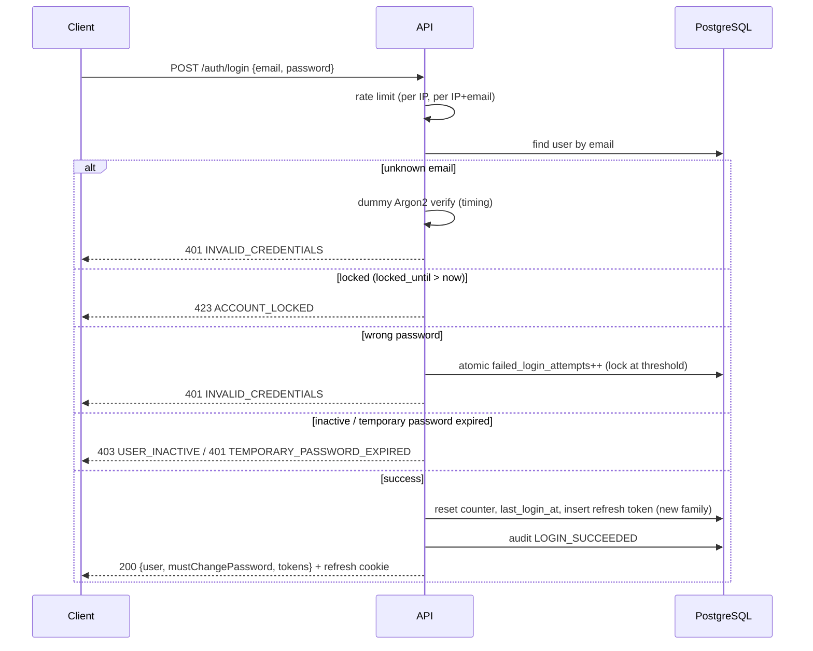
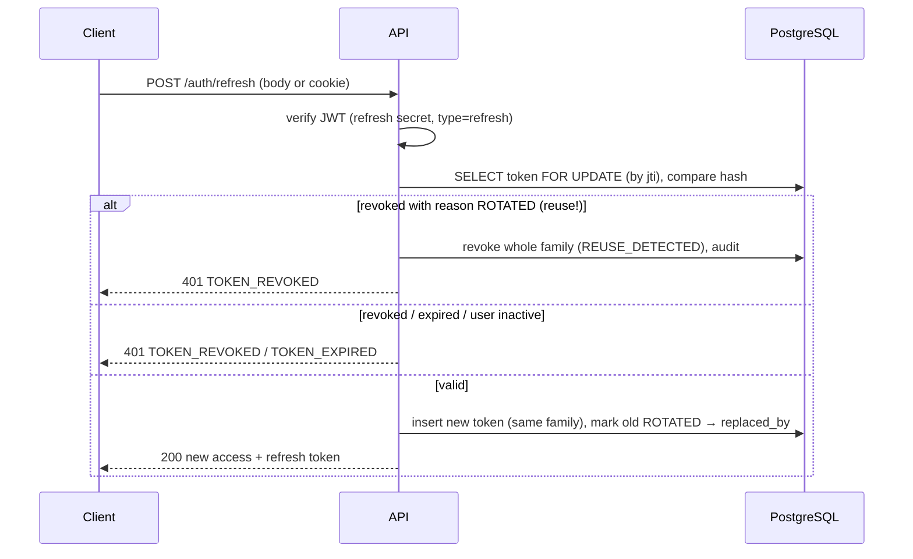

# Authentication

## Tokens and sessions

| Token         | Format                          | Lifetime (default)            | Storage                                                                                                                                       |
| ------------- | ------------------------------- | ----------------------------- | --------------------------------------------------------------------------------------------------------------------------------------------- |
| Access token  | JWT HS256, `JWT_ACCESS_SECRET`  | 15 minutes                    | Client memory; sent as `Authorization: Bearer`                                                                                                |
| Refresh token | JWT HS256, `JWT_REFRESH_SECRET` | 7 days (sliding per rotation) | Response body **and** `httpOnly`, `SameSite=Strict`, `Secure` (production) cookie scoped to `/api/v1/auth`; server stores only a SHA-256 hash |

Access-token claims (no secrets, no email):

```json
{
  "sub": 15,
  "userId": 15,
  "name": "John Doe",
  "role": "TECHNICIAN",
  "phone": "0780000000",
  "type": "access",
  "sid": "7f0c…",
  "iat": 1789130000,
  "exp": 1789130900,
  "iss": "maintenance-monitor",
  "aud": "maintenance-monitor-clients"
}
```

Refresh-token claims: `sub`, `type: "refresh"`, `sid` (session/family id), `jti` (row id).

Verification pins the algorithm, issuer and audience, checks the `type` claim (a refresh token can never be used
as an access token) and validates the claim shape.

**Every authenticated request** also confirms in the database that the user is active and the session (`sid`)
still has a live refresh token. Logout, password change/reset and deactivation therefore take effect
immediately, and role changes apply without waiting for token expiry.

## Login



Unknown email and wrong password produce the same response. Account state (inactive, expired temporary
password) is only revealed to callers who supplied the correct password. Successful and failed logins are audited.

### Brute-force protection

- **Account lockout:** after `LOGIN_MAX_ATTEMPTS` (5) failures the account locks for `LOGIN_LOCK_MINUTES` (15).
  The counter update is a single atomic `UPDATE … RETURNING`, so concurrent guesses cannot exceed the limit.
  Wrong current passwords on `change-password` also count.
- **Rate limits:** per IP+email on login, per IP across login/refresh, per IP on forgot/reset password, plus a
  global per-IP limit. Limited requests get `429 RATE_LIMITED` with `RateLimit` headers.

## Refresh-token rotation and reuse detection



Replaying an already-rotated refresh token is treated as theft: every token in that session is revoked, which
also invalidates access tokens carrying that `sid`. Clients should serialise refresh calls (e.g. one in-flight
refresh shared across tabs).

## Logout

`POST /auth/logout` (access token required, allowed during onboarding) revokes the session family, clears the
cookie and records `LOGOUT`.

## First-time technician onboarding

1. An ADMIN calls `POST /users`. The service generates a 16-character cryptographically random temporary password,
   hashes it with Argon2id, sets `must_change_password = true` and `password_expires_at = now + TEMP_PASSWORD_TTL_HOURS`.
2. The credential is emailed through the company SMTP server **before the transaction commits**. If delivery fails,
   nothing is created (`503`). The password is never returned by the API or logged.
3. The technician logs in (the response has `mustChangePassword: true`). Until the password is changed, only
   `POST /auth/change-password`, `POST /auth/logout` and `GET /users/me` are accessible; everything else returns
   `403 PASSWORD_CHANGE_REQUIRED` (also enforced on the WebSocket).
4. `POST /auth/change-password` stores the new hash, clears `must_change_password` and `password_expires_at`
   (invalidating the temporary credential), revokes all sessions and returns a fresh session.
5. An expired temporary credential is rejected with `401 TEMPORARY_PASSWORD_EXPIRED`; an ADMIN can issue a new one
   with `POST /users/:id/reissue-temporary-password` (also revokes sessions).

## Change password

`POST /auth/change-password {currentPassword, newPassword}` — requires the current password (failures count
toward lockout), rejects re-using the current password (`422 PASSWORD_REUSE`), revokes **all** sessions, issues a
new session and emails a notice (except when completing onboarding).

Password policy: 12–128 characters with lower-case, upper-case and a digit. The 128-character cap also bounds hashing cost.

## Forgot / reset password

```mermaid
sequenceDiagram
  participant C as Client
  participant A as API
  participant DB as PostgreSQL
  participant M as SMTP
  C->>A: POST /auth/forgot-password {email}
  alt active account exists
    A->>DB: invalidate outstanding tokens; insert SHA-256(token), expires in 30 min; audit
    A-)M: email link PASSWORD_RESET_URL?token=… (not awaited)
  end
  A-->>C: 200 generic message (always identical)
  C->>A: POST /auth/reset-password {token, newPassword}
  A->>DB: SELECT token by hash FOR UPDATE — unused, unexpired, user active?
  A->>DB: mark used, set password, revoke ALL sessions, audit
  A-->>C: 200 "log in with your new password"
```

- Tokens are 256-bit random values; only their SHA-256 hash is stored; they expire after
  `PASSWORD_RESET_TTL_MINUTES` and are single-use. Requesting a new link invalidates older ones.
- The response never reveals whether the email exists, and email delivery happens asynchronously so response
  time does not depend on it.
- After a reset every session is revoked and the user must log in again. Resetting also completes onboarding.

## Password storage

Argon2id with `ARGON2_MEMORY_COST` (19 MiB), `ARGON2_TIME_COST` (2) and `ARGON2_PARALLELISM` (1) by default —
the OWASP minimum recommendation. Raise them for your hardware; existing hashes are upgraded transparently at the
next successful login.

## Housekeeping

`TokenCleanupService` runs hourly and deletes refresh and reset tokens that expired more than 30 days ago.
