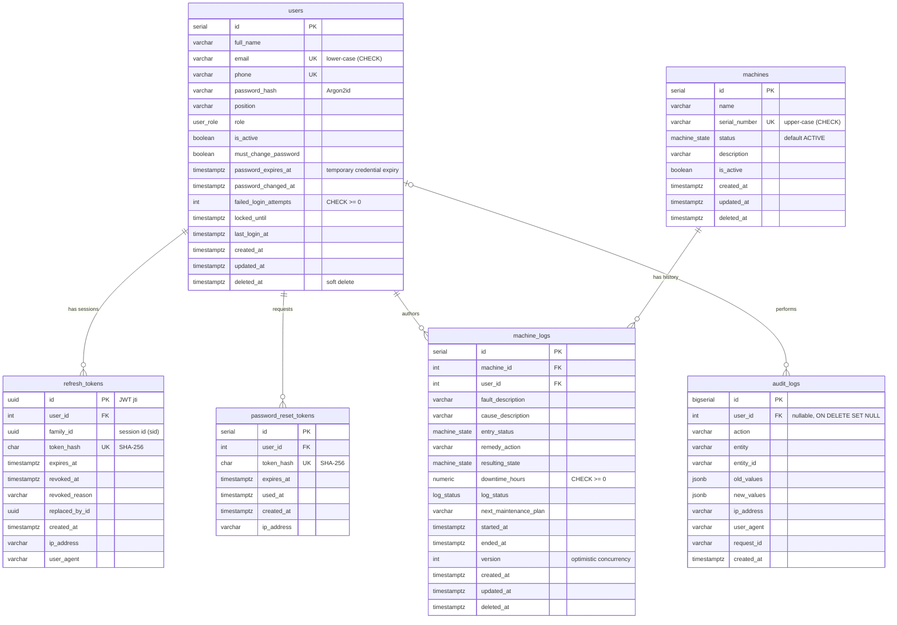

# Database

PostgreSQL (14+; the Docker stack uses 16). The schema is managed **only** by migrations
(`synchronize` is disabled everywhere). All timestamps are `timestamptz` and stored in UTC.

## Entity relationships



## Enum types

| Type            | Values                                                  | Used by                                                                        |
| --------------- | ------------------------------------------------------- | ------------------------------------------------------------------------------ |
| `user_role`     | `ADMIN`, `TECHNICIAN`                                   | `users.role`                                                                   |
| `machine_state` | `ACTIVE`, `UNDER_MAINTENANCE`, `DOWNTIME`, `UNDER_TEST` | `machines.status`, `machine_logs.entry_status`, `machine_logs.resulting_state` |
| `log_status`    | `OPEN`, `CLOSED`                                        | `machine_logs.log_status`                                                      |

`machine_state` is a single shared type, mirrored by the reusable `MachineState` TypeScript enum.

## Constraints

| Constraint                                                            | Rule                                                                |
| --------------------------------------------------------------------- | ------------------------------------------------------------------- |
| `UQ_users_email`, `UQ_users_phone`                                    | Email and phone are globally unique (including soft-deleted users)  |
| `CHK_users_email_lowercase`                                           | Emails are stored normalised to lower case                          |
| `CHK_users_failed_login_attempts`                                     | Counter is never negative                                           |
| `UQ_machines_serial_number`, `CHK_machines_serial_number_uppercase`   | Serial numbers are unique, normalised to upper case                 |
| `FK_machine_logs_machine_id`, `FK_machine_logs_user_id`               | `ON DELETE RESTRICT` — history can never lose its machine or author |
| `CHK_machine_logs_downtime_non_negative`                              | `downtime_hours >= 0`                                               |
| `CHK_machine_logs_ended_after_started`                                | `ended_at IS NULL OR ended_at >= started_at`                        |
| `CHK_machine_logs_status_end_time`                                    | `OPEN ⇒ ended_at IS NULL`, `CLOSED ⇒ ended_at IS NOT NULL`          |
| `UQ_refresh_tokens_token_hash`, `UQ_password_reset_tokens_token_hash` | Token hashes are unique                                             |
| `FK_refresh_tokens_user_id`, `FK_password_reset_tokens_user_id`       | `ON DELETE CASCADE` (credentials only)                              |
| `FK_audit_logs_user_id`                                               | `ON DELETE SET NULL` — the trail survives any user removal          |

The application validates the same rules first (for friendly errors); the constraints are the last line of defence.

## Indexes

| Index                                                                                                             | Purpose                                                  |
| ----------------------------------------------------------------------------------------------------------------- | -------------------------------------------------------- |
| `UQ_users_email`, `UQ_users_phone` (unique)                                                                       | Login and uniqueness lookups                             |
| `UQ_machines_serial_number` (unique)                                                                              | Serial lookups                                           |
| `IDX_machines_status`                                                                                             | Status board filters and analytics                       |
| `IDX_machine_logs_machine_id_created_at`                                                                          | Machine history (also serves plain `machine_id` lookups) |
| `IDX_machine_logs_user_id`                                                                                        | Logs by technician                                       |
| `IDX_machine_logs_created_at`                                                                                     | Default ordering                                         |
| `IDX_machine_logs_log_status`                                                                                     | Open/closed filters                                      |
| `IDX_machine_logs_resulting_state`                                                                                | State filters                                            |
| `IDX_refresh_tokens_user_id`, `IDX_refresh_tokens_family_id`, `IDX_refresh_tokens_expires_at`                     | Session revocation, per-request session check, cleanup   |
| `IDX_password_reset_tokens_user_id`                                                                               | Invalidating outstanding reset tokens                    |
| `IDX_audit_logs_user_id`, `IDX_audit_logs_action`, `IDX_audit_logs_created_at`, `IDX_audit_logs_entity_entity_id` | Audit browsing filters                                   |

## Soft deletion

Users, machines and machine logs use `deleted_at`. Soft-deleted rows disappear from normal queries but remain
referenced by history: machine logs still show their machine and technician, and audit entries keep their actor.
Deleting a user or machine also sets `is_active = false`.

## Migrations

- Location: `src/database/migrations/`, registered in `src/database/migrations/index.ts` (explicit list, works
  identically from `src` and compiled `dist`).
- History table: `schema_migrations`. Each migration runs in its own transaction.
- `InitialSchema1789000000000` is hand-written so the shared enum is created once and objects are created in
  dependency order.

```bash
npm run migration:show                                    # pending?
npm run migration:run                                     # apply
npm run migration:revert                                  # undo the last one
npm run migration:check                                   # fails if entities and schema differ
npm run migration:generate -- src/database/migrations/AddSites   # after changing entities, then review & register it
```

In containers run `node dist/database/scripts/migrate.js run` (the `migrate` service in `docker-compose.yml`)
before starting the API. Never enable `synchronize` in any environment.
