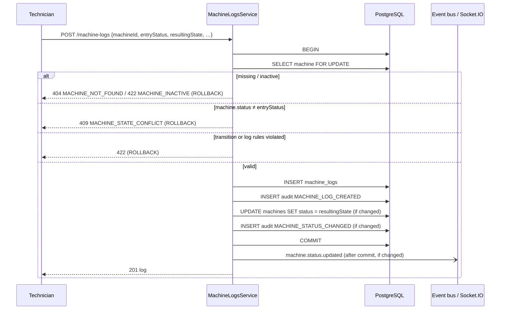

# Machine state, logs and synchronisation

## Core invariant

> A machine's `status` always equals the `resulting_state` of its most recent (non-deleted) machine log.
> New machines start `ACTIVE`. Nothing but machine-log operations can change status.

## States

| State               | Meaning                                |
| ------------------- | -------------------------------------- |
| `ACTIVE`            | Operating normally                     |
| `UNDER_MAINTENANCE` | Being repaired/serviced                |
| `DOWNTIME`          | Stopped / unavailable                  |
| `UNDER_TEST`        | Trial run after work, not yet released |

## Transition policy

Defined once in `src/machine-logs/policies/machine-state-transition.policy.ts`
(`DEFAULT_MACHINE_STATE_TRANSITIONS`) and exposed to clients by `GET /api/v1/machines/state-transitions`.

| From \ To             |      ACTIVE      | UNDER_MAINTENANCE |     DOWNTIME     |    UNDER_TEST    |
| --------------------- | :--------------: | :---------------: | :--------------: | :--------------: |
| **ACTIVE**            | same-state entry |        ✅         |        ✅        |        ✅        |
| **UNDER_MAINTENANCE** |        ✅        | same-state entry  |        ✅        |        ✅        |
| **UNDER_TEST**        |        ✅        |        ✅         |        ✅        | same-state entry |
| **DOWNTIME**          |        ✅        |        ✅         | same-state entry |        ✅        |

**Same-state entries** (e.g. an inspection on an `ACTIVE` machine that stays `ACTIVE`) are allowed by default
(`allowSameStateEntries: true`): they record activity without changing status or emitting an event.

A disallowed transition returns `422 INVALID_STATE_TRANSITION` with the allowed targets in `details`.
To change the rules, edit the table or construct the policy with another table/options in `container.ts`.

## Log status rules

Centralised in `src/machine-logs/policies/machine-log-rules.policy.ts` and applied to the final state of a log
on create and update:

| Rule                                                                                                         | Error                          |
| ------------------------------------------------------------------------------------------------------------ | ------------------------------ |
| `OPEN` means the event is ongoing: `ended_at` must be empty                                                  | `422 INVALID_LOG_STATUS`       |
| `CLOSED` means the event is complete: `ended_at` is required (defaults to now when closing)                  | `422 INVALID_LOG_STATUS`       |
| While a machine's **most recent** log leaves it `DOWNTIME` or `UNDER_MAINTENANCE`, that log must stay `OPEN` | `422 INVALID_LOG_STATUS`       |
| `ended_at >= started_at`; neither may be more than 5 minutes in the future                                   | `422 INVALID_LOG_TIMES`        |
| `downtime_hours >= 0` and not more than `ended_at − started_at`                                              | `400` / `422 INVALID_DOWNTIME` |

Historical logs (no longer the most recent) may be closed even if their resulting state was `DOWNTIME`, because the
machine has since moved on. The set of "must stay open" states is configurable (`statesRequiringOpenLog`).

## Downtime

`src/machine-logs/policies/downtime-calculator.ts`:

1. An explicit `downtimeHours` always wins (send `0` for work that did not stop the machine).
2. Otherwise, once a log has an end time, downtime = `ended_at − started_at` in hours (2 decimals).
3. Otherwise (ongoing event) downtime is `0`.

Downtime is recalculated when a log's timing changes (`startedAt`, `endedAt`, `logStatus`) unless a value is supplied.
The calculator is isolated so a future version can derive downtime from status history.

## Two ways to record an event

Both models keep the invariant:

- **One log per event** — open a log (`ACTIVE → DOWNTIME`, `OPEN`), then `PATCH` its `resultingState` as work
  progresses (`UNDER_MAINTENANCE`, `UNDER_TEST`, `ACTIVE`) and finally close it.
- **One log per state change** — create a new log for each step; each log's `entryStatus` is the previous
  log's `resultingState`. Earlier logs can be closed afterwards.

## Creating a log (synchronisation algorithm)

If any step fails, the whole transaction rolls back: no log, no status change, no audit rows, no event.
This is verified by tests that inject a failure after each write.

## Updating a log

1. Lock the machine, then the log (same lock order as create/delete → no deadlocks).
2. `version` must equal the stored version, else `409 STALE_VERSION` (protects concurrent edits of one log).
3. `machineId`, `entryStatus` and the author are immutable history (rejected by the schema).
4. `resultingState` may only change on the machine's **most recent** log (`409 RESULTING_STATE_IMMUTABLE` otherwise).
   The machine must still be in the log's previous resulting state, and `entryStatus → newResultingState` must be allowed.
5. Log rules and downtime are re-evaluated; the version increments; changes are audited with old/new values; status
   is synchronised and the event is published after commit.

## Deleting a log (ADMIN)

Soft delete inside the same locked transaction. If it was the machine's most recent log, the machine reverts to
that log's `entryStatus` — the state it was in immediately before the event (verified at creation) — and a status
change is audited and published. Deleting an older log does not change status.

## Concurrency

- **Pessimistic lock:** every status-affecting operation starts with `SELECT … FOR UPDATE` on the machine row, so
  operations on the same machine are serialised while different machines proceed in parallel.
- **Expected state:** `entryStatus` doubles as the client's expected current status. When two technicians act on the
  same machine simultaneously, the second one sees the new status after the first commits and receives
  `409 MACHINE_STATE_CONFLICT` — nothing is silently overwritten. The client reloads and retries.
- **Optimistic versions** protect concurrent edits of the same log (`409 STALE_VERSION`).
- **Latest log** is determined by `id`, which is assigned while the machine lock is held and is therefore strictly
  ordered per machine (`created_at` records transaction start time and could invert under contention).

Tests fire 12 simultaneous conflicting requests at one machine and assert that exactly one succeeds and the
invariant holds.
